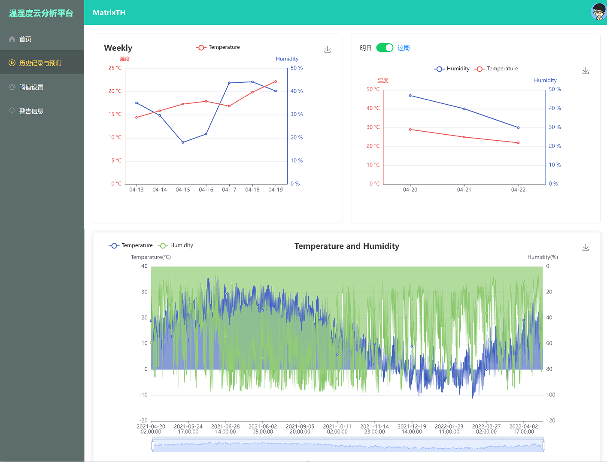

# MatrixTH

​		  该项目旨在为平台打造一个软硬件设计。在多个Arduino平台上可以通过扩展板周期性地实时测量出周围环境地温度和湿度，并且通过NRF24将每个Arduino测量的数据通过无线传输的方式反馈给后端记录平台。后端硬件平台为树莓派，在后端开出一个线程专门接收从硬件传输过来的数据，每个数据串需要记载的信息有：测量硬件平台（Arduino）的唯一编号，该平台得到的环境温湿度数据。后端还会将这几个数据录入后台的数据库中，用户登录云平台后就可以把数据用表格方式的方式展现。后端可以通过调用api的方式可以预测出未来几天本市的温湿度数据，前端可以将这些数据可视化地展示给已经登录的用户。用户可以设置需要被提醒的数据边界，实时数据越过被提醒者的提示数据值时，平台将对需要收到提醒的用户发送相关信息，提醒用户及时进行调节有关方案。

```
.
├── asset       图片文件
├── back_end    后端文件
├── data        数据文件
├── front_end   前端文件
├── rasphberry  树莓派硬件文件
└── sketch      Arduino硬件文件

```



